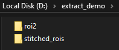
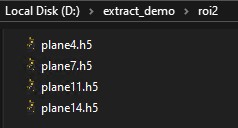
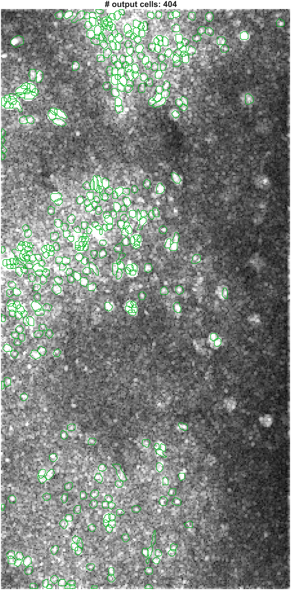
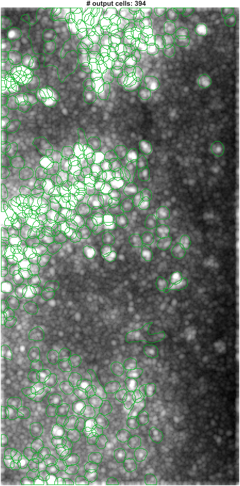
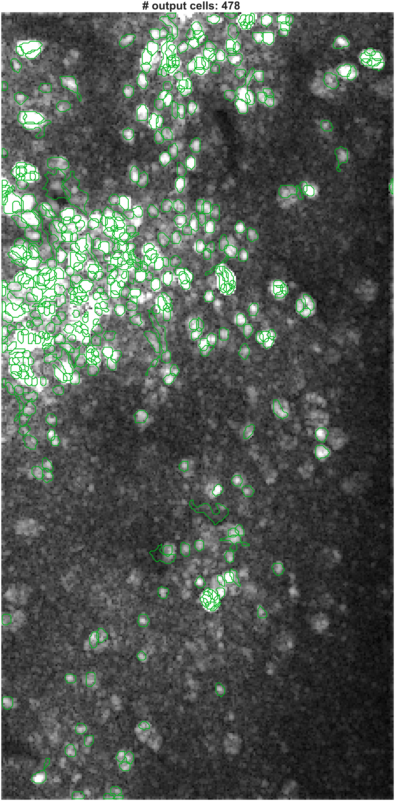
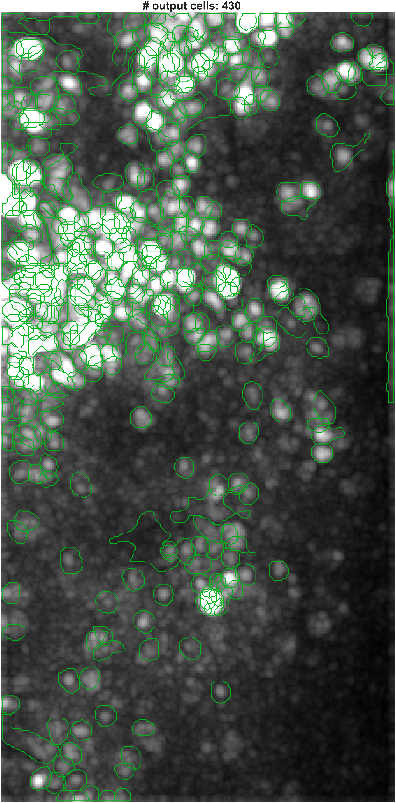

# Miller Brain Observatory: EXTRACT Pipeline Demo

This demo shows how to use the MBO Utilities pipeline to run EXTRACT on multi-plane imaging data.
It assumes your data is stored in HDF5 format, with each z-plane saved separately.

This pipeline accepts h5 timeseries as inputs.

## Installation

First, install `mbo_utilities` by following the guide [here](https://millerbrainobservatory.github.io/mbo_utilities/install.html).
Next, install EXTRACT-public via their [installation instructions](https://github.com/MillerBrainObservatory/EXTRACT-public?tab=readme-ov-file#installation).

## Data Extraction

Organize your dataset so that each z-plane is saved as a separate HDF5 file in the same folder.

Example:

```
D:/tests/data/EXTRACT/
├── plane1.h5
├── plane2.h5
├── ...
```

## Running the Pipeline

### Prep data

EXTRACT takes planar timeseries in `.h5` format as input.

The easiest way to get raw scanimage `.tif` into this format is using [mbo_utilities](https://millerbrainobservatory.github.io/mbo_utilities/install.html). 
This requires python, though its a simple installation and is well documented (see the [user-guide](https://millerbrainobservatory.github.io/mbo_utilities/assembly.html) on converting tiffs using these python utilities))

``` python
# Option 1: Stitch the roi's before saving
import mbo_utilities as mbo
volume = mbo.imread(r"path/to/raw_tiffs")
volume.shape
Out[4]: (5632, 14, 448, 448)
mbo.imwrite(volume, "D://extract_demo//stitched_rois", planes=[4, 7, 11, 14], ext="h5")
# Option 1: Save individual rois (will save every plane in an roiN folder)
volume.roi = 2
volume.shape
Out[7]: (5632, 14, 448, 224)
mbo.imwrite(volume, "D://extract_demo", planes=[4, 7, 11, 14], ext="h5")
```




### Run Extract

Open `runEXTRACT.m` and set the path to your data folder:

```matlab
% Use double backslashes (`\\`) on Windows.
data_path = "D://extract_demo//";
runEXTRACT(data_path);
```

This will run each `*plane*.h5`, as long as `output` is not in it's filename (as is the case with outputs).

Note that each time you run the funtion, it will overwrite data saved in the `root` directory.

```markdown
## ``runEXTRACT.m``

Runs EXTRACT on all ``plane\\*.h5`` files under a specified directory. Optionally generates PNG visualizations of extracted cell masks.

```matlab
runEXTRACT(rootDir)
runEXTRACT(rootDir, savePlots, cfg)
```

| Argument     | Type    | Description                                                  |
|--------------|---------|--------------------------------------------------------------|
| ``rootDir``    | string  | Root directory containing ``plane\\*.h5`` files.                 |
| ``savePlots``  | logical | *(Optional)* If ``true``, saves PNG cell mask images (default: ``true``). |
| ``cfg``        | struct  | *(Optional)* Partial EXTRACT config struct. Only valid fields are applied. |

Each ``plane\\*.h5`` file must contain a dataset at path ``/mov`` shaped ``(Y, X, T)``.

---

### Key Config Values

- ``thresholds.T_min_snr``: Increase to suppress noise (e.g., ``3.5`` → ``5.0``)  
- ``cellfind_min_snr``: Lowering this will pick up more low-SNR cells  
- ``use_gpu``: Set to ``0`` to disable GPU use  
- ``adaptive_kappa``: Enables dynamic thresholding in spatial extraction

<p><strong>Plane 4</strong></p>
<div style="display: flex; gap: 10px;">
  
  
</div>

<p><strong>Plane 7</strong></p>
<div style="display: flex; gap: 10px;">
  
  
</div>


---

### Outputs

For each ``plane\\*.h5`` file:  
- HDF5 output saved to:
  ``outputs/planeN_outputs.h5``  
- If ``savePlots == true``:  
  ``outputs/planeN_masks.png``  

All outputs are stored in an ``outputs/`` subdirectory next to the input file.

Note: The output plot shown during cellfinding (when the algorithm is running) has a ``red to gray`` colormap, so bright values are red instead of white.

---

### Examples

**Run with defaults:**
```matlab
runEXTRACT('/data/session1')
```

**Run with plotting disabled:**
```matlab
runEXTRACT('/data/session1', false)
```

**Run with custom config:**
```matlab
cfg = struct();
cfg.cellfind_min_snr = 1.5;
cfg.thresholds = struct();
cfg.thresholds.T_min_snr = 4.0;
cfg.use_gpu = 0;
runEXTRACT('/data/session1', true, cfg)
```
```
